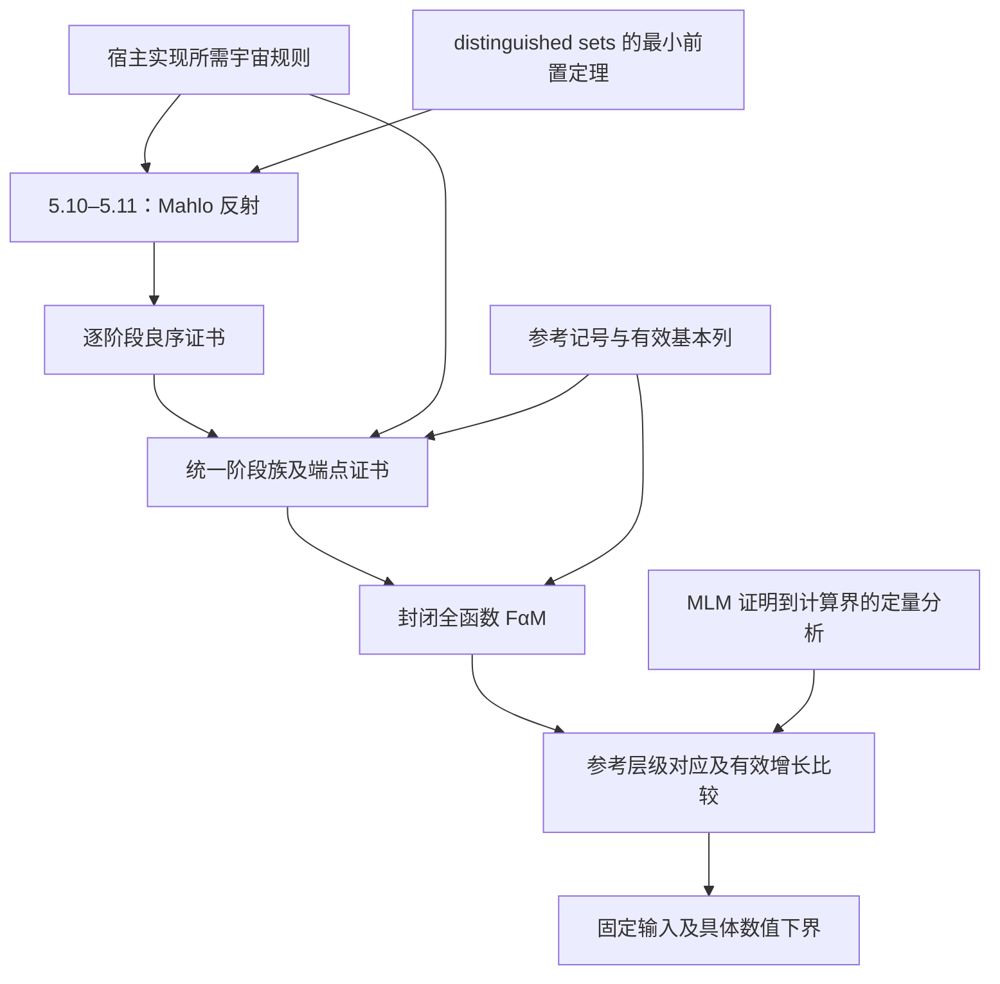

# 关键路径：先判断飞跃能否成立，再扩大形式化

日期：2026-09-09。此执行顺序优先于第五轮“立即实现完整比较”的安排；最终目标及 C1–C7 不变。

## 判断与调整

前五轮建立了一些可复用基础，但尚未通过决定路线可行性的关卡。语法、判等和有限闭包持续编译成功，不能证明宿主足以实现 Mahlo 反射、统一逐阶段证书到端点，或认证函数量级。

暂停完整比较、正规性、自然数编码及外围库扩展。先产出可审阅的数学证明草案、类型与宇宙预算，以及针对真正疑点的最小编译实验。接口中的假设必须登记为债务，不能将条件接口编译通过记为数学关卡通过。

## 证明依赖

这是证明依赖图，不是必须按顺序完成全部代码的日程。现在就审计端点和定量分析，避免完成阶段良序工程后才发现桥梁缺失。

## 优先消除的四个不确定性

| 关卡 | 决定性问题 | 最小调查产物与通过标准 |
|---|---|---|
| A：宿主与反射 | 当前外部子宇宙能否承载 5.10 的实际算子并完成 5.11？ | 写出 f、g 的输入输出、见证构造和宇宙层级，给出证明骨架；每次闭包应用有类型依据，无未登记的选择、缩小或额外规则 |
| B：端点统一化 | 每个固定 n 的证明能否成为固定宿主类型中的统一证书函数？ | 列出 W₀、Wₙ₊₁ 的类型与递归状态，说明阶段初始段如何拼接到端点；说明层级是否随 n 变化、所需增强是什么，不能仅凭元归纳或 Set₁ 下结论 |
| C：有效层级 | 基本列能否与该良序证明及独立参考层级配合？ | 固定一个参考候选及准确来源，列出下降、共尾、有效比较性质的证明或缺口；不能只说“以后用范数法”，此时也不必实现全部算术 |
| D：量级认证 | 如何从 MLM 可证全性证明得到低于 α_M 的计算界？ | 固定函数表示，追踪定量上界来源及到 FGH 的中间命题；核对定理适用条件，或给出缺失定理及可信证明路线。只有证明论序数数值不算通过 |

四关均未通过。这些是投入决策所需的证据，不是四项普通编码任务。

## 下一次研究的具体交付

先做两张表、一份证明骨架：

1. **5.10 实际算子类型表**：逐条指出 `External` 已满足什么、还差什么。先审计直接移植关键证明项所需规则，不立即全面建立 MLM 语法健全性工程。
2. **阶段到端点的宇宙预算表**：明确统一递归的状态、阶段操作和证书类型。可以参数化尚未证明的阶段定理来检查类型，但这些参数必须保留为待证项。
3. **5.10–5.11 的数学证明骨架**：从结论倒推最小 distinguished-set 定理集；先检查关键数学步骤，再决定必须实现哪些具体记号引理。

同时尽早登记 D 的文献缺口。若没有足够的定量分析来源，应报告“量级认证路线未落实”，不能因为 A、B 看起来可行就宣布整个项目可行。

每次更新说明：消除了哪个不确定性、新发现了哪个必要假设、证据在哪里、是否改变投入顺序。代码行数和模块数不作为关键路径进度。

## 恢复细节实现的条件

A、B 有可审阅且无隐藏原则的方案，C、D 有明确来源或待证桥梁及可评估的证明路线后，再围绕最小依赖逐项实现。无需等待全部证明形式化完成，但不能把没有方案的缺口当作普通工程量。

此前只插入能检验关卡的最小实验，例如实际族算子的正性、反射见证的层级或阶段递归的类型。不单独扩展完整比较库、泛化接口或大数求值器。

某关卡失败时报告精确失败点，研究替代宿主或证明路线；不把目标换成较低序数、逐阶段结果或只有名称的函数。

已有依据：[宿主审计](THEORY.md)、[反射依赖](REFLECTION-PLAN.md)、[端点审计](ENDPOINT.md)、[基本列方案](FUNDAMENTAL-PLAN.md)、[量级契约](CALIBRATION.md)。
